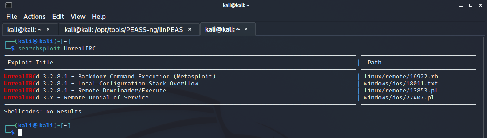

# Index
1. [Enumeration](#enumeration)
	<br>
	1.1 [Nmap](#nmap)
	</br>
	
2. [Privesc](#privesc)

#### Tags
<details markdown='1'>
<summary>Click to get a hint</summary> 
<ul>
	<li>IRC</li>
	<li>Stego</li>
	<li>SUID privilege escalation</li>
</ul>
</details>

### Enumeration
**IP Address** 10.10.10.117
#### Nmap
My first step, as in any other machine, is running an Nmap scan.
I'm used to running in first place *Nmap -p- {ip}* so it does a scan through all 65535 ports of the machine. After this scan, I usually run a more specific scan through the open ports. In this case, the second scan showed me the following results:
```shell
sudo nmap -sC -sV -O -p 22,80,111,8067,37395,65534 10.10.10.117
[sudo] password for kali: 
Starting Nmap 7.91 ( https://nmap.org ) at 2021-10-15 12:19 EDT
Nmap scan report for 10.10.10.117
Host is up (0.051s latency).

PORT      STATE SERVICE VERSION
22/tcp    open  ssh     OpenSSH 6.7p1 Debian 5+deb8u4 (protocol 2.0)
| ssh-hostkey: 
|   1024 6a:5d:f5:bd:cf:83:78:b6:75:31:9b:dc:79:c5:fd:ad (DSA)
|   2048 75:2e:66:bf:b9:3c:cc:f7:7e:84:8a:8b:f0:81:02:33 (RSA)
|   256 c8:a3:a2:5e:34:9a:c4:9b:90:53:f7:50:bf:ea:25:3b (ECDSA)
|_  256 8d:1b:43:c7:d0:1a:4c:05:cf:82:ed:c1:01:63:a2:0c (ED25519)
80/tcp    open  http    Apache httpd 2.4.10 ((Debian))
|_http-server-header: Apache/2.4.10 (Debian)
|_http-title: Site doesn't have a title (text/html).
111/tcp   open  rpcbind 2-4 (RPC #100000)
| rpcinfo: 
|   program version    port/proto  service
|   100000  2,3,4        111/tcp   rpcbind
|   100000  2,3,4        111/udp   rpcbind
|   100000  3,4          111/tcp6  rpcbind
|   100000  3,4          111/udp6  rpcbind
|   100024  1          37395/tcp   status
|   100024  1          39240/udp6  status
|   100024  1          43552/udp   status
|_  100024  1          50881/tcp6  status
6697/tcp  open  irc     UnrealIRCd
8067/tcp  open  irc     UnrealIRCd
37395/tcp open  status  1 (RPC #100024)
65534/tcp open  irc     UnrealIRCd
Warning: OSScan results may be unreliable because we could not find at least 1 open and 1 closed port
Aggressive OS guesses: Linux 3.12 (95%), Linux 3.13 (95%), Linux 3.16 (95%), Linux 3.18 (95%), Linux 3.2 - 4.9 (95%), Linux 3.8 - 3.11 (95%), Linux 4.4 (95%), Linux 4.8 (95%), Linux 4.9 (95%), Linux 4.2 (95%)
No exact OS matches for host (test conditions non-ideal).
Network Distance: 2 hops
Service Info: Host: irked.htb; OS: Linux; CPE: cpe:/o:linux:linux_kernel

OS and Service detection performed. Please report any incorrect results at https://nmap.org/submit/ .
Nmap done: 1 IP address (1 host up) scanned in 25.60 seconds
```

While the *nmap* was working, I tried to do a further investigation at the 80 port. 
In this port we can observe a web page with only a picture. After performing some *fuzzing* with *gobuster* and *ffuf*, I found nothing.


  
  
Here I had to choose between going further with te RCP or with the IRC.
I decided to go with the RCP, so I run *rcpinfo*, obtaining the following:

```shell
 rpcinfo irked.htb
   program version netid     address                service    owner
    100000    4    tcp6      ::.0.111               portmapper superuser
    100000    3    tcp6      ::.0.111               portmapper superuser
    100000    4    udp6      ::.0.111               portmapper superuser
    100000    3    udp6      ::.0.111               portmapper superuser
    100000    4    tcp       0.0.0.0.0.111          portmapper superuser
    100000    3    tcp       0.0.0.0.0.111          portmapper superuser
    100000    2    tcp       0.0.0.0.0.111          portmapper superuser
    100000    4    udp       0.0.0.0.0.111          portmapper superuser
    100000    3    udp       0.0.0.0.0.111          portmapper superuser
    100000    2    udp       0.0.0.0.0.111          portmapper superuser
    100000    4    local     /run/rpcbind.sock      portmapper superuser
    100000    3    local     /run/rpcbind.sock      portmapper superuser
    100024    1    udp       0.0.0.0.170.32         status     107
    100024    1    tcp       0.0.0.0.146.19         status     107
    100024    1    udp6      ::.153.72              status     107
    100024    1    tcp6      ::.198.193             status     107

```

As I didn´t see anything to go on, I decided to go back to the IRC.
First of all, when I know a technology that is used in the server, such as UnrealIRCd, I like to search it with *searchsploit*, so I can get an idea about the vulnerabilities this technology has.



As we can see, there is a possible backdoor via metasploit. However, we don´t know the version yet. In order to know the version, I try to connect with the IRC server.  To do so, I used set of tools called [irssi](https://irssi.org/)
```shell
irssi -c 10.10.10.117 --port 8067
```


Once I connected to the server, I was able to see the UnreallRCd version. As expected, it was 3.2.8.1, so we know it is vulnerable to the backdoor that we saw before. However, in order to avoid metasploit, I searched for another exploit, finding this [one](https://github.com/Ranger11Danger/UnrealIRCd-3.2.8.1-Backdoor). It gives the attacker several options for the payload. I ended up chosing *python*.

Before running the exploit, it is necessary to change the exploit in order to add your own IP and port (attacker's machine) and, of course, it is mandatory to start a listener.

This is the command to run the exploit:

```shell 
python3 exploit.py 10.10.10.117 8067 -payload python
```

We can finally obtain a shell as the user *ircd*


After listing the directory *home*, it is possible to discover another user, *djmardov*. Running the following command, it is also possible to find the user flag. 


```shell
ircd@irked:/tmp$ locate user.txt
locate user.txt
/home/djmardov/Documents/user.txt

ircd@irked:/tmp$ ls -lrt /home/djmardov/Documents
ls -lrt /home/djmardov/Documents
total 4
-rw------- 1 djmardov djmardov 33 May 15  2018 user.txt
```

Nevertheless, the user *ircd* does not have permission to read it, so now we need to get access as the user *djmardov*.

After running [linpeas](https://github.com/carlospolop/PEASS-ng/tree/master/linPEAS) we find a rare hidden file in *djmardov*'s directory:


Weird backup files are always interesting and should be taken into account.
In this case, it is possible to read this file:
```shell
ircd@irked:/tmp$ strings /home/djmardov/Documents/.backup
strings /home/djmardov/Documents/.backup
Super elite steg backup pw
UPupDOWNdownLRlrBAbaSSss
```

So, we have a password righ now and a hint: *Super elite steg backup pw*.
The first thing I try was to access to the machine as *djmardov* with this password by *su djmardov* and by ssh. It wasn't possible, so after reading again the hint, I recalled that we had a web page with only one picture. It was time for stego. 
In order to download the picture in the web and to extract the image, I used the following commands:


With this password, it is possible to establish an ssh session as the user *djmardov* and retrieve the content in *user.txt*. Now it's time for privesc:

### Privesc

After running again *linpeas*, I was not sure were to go on. I usually have 3 tools for privesc:
- Linpeas/Linenum
- [suid3num](https://github.com/Anon-Exploiter/SUID3NUM)
- [pspy](https://github.com/DominicBreuker/pspy)


I know suid3num has a similar output to Linpeas, but for me it's easier to analyze the SUID output with this tool. On the other side, pspy is the tool for the moment in which I don´t know what else to do, so I can see if there's any process running I haven´t seen before.
In case it's the first time you hear about SUID privilege escalation, I recommend you to read this [article](https://www.hackingarticles.in/linux-privilege-escalation-using-suid-binaries/)

Following with irked, suid3num provides us with an interesting output:  
  
  


After running *viewuser*, we can see an strange error message:


It seems that the binary is looking for a file called *listusers* and located at */tmp*
As there is no such file in */tmp* directory, I created one file with the command *id* and run again the binary *viewuser*:


As it can be seen, the error message has changed. This is because the user *root* doesn´t have execution permissions. To get this, it is necessary to run the command:
```
chmod a+x listusers
```
Once that's done, we run again the binary *viewuser*:


As we expected, the binary executes the command. To obtain a shell as root, the only thing left to do is to change the file *listusers* from *id* to */bin/bash*:


Please, feel free to [contact](https://twitter.com/sergioframi)  me if you want to ask or share anything about this machine. Thanks a lot! 